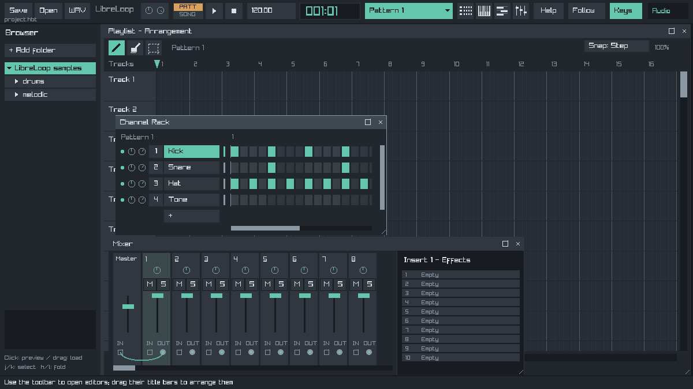

# LibreLoop

A small, self-contained Linux and macOS DAW written in C with raylib and miniaudio. Includes built-in instruments/effects, audio and MIDI recording. Work in progress.



Build on Linux or macOS with CMake and a C11 compiler. See the
[development guide](docs/development.md) for platform dependencies.

```sh
cmake -S . -B build -DCMAKE_BUILD_TYPE=Release
cmake --build build --parallel
```

On Linux, launch the executable:

```sh
./build/libreloop
```

On macOS, launch the app bundle:

```sh
open build/LibreLoop.app
```

On Linux, `cmake --install build --prefix "$HOME/.local"` installs the executable,
resources, desktop entry and notices.

The macOS bundle includes its demo samples and font and can be moved out of
the checkout. It is currently unsigned.

[Build dependencies](docs/development.md) · [GPL-3.0](LICENSE) · [Third-party notices](docs/third-party.md)
